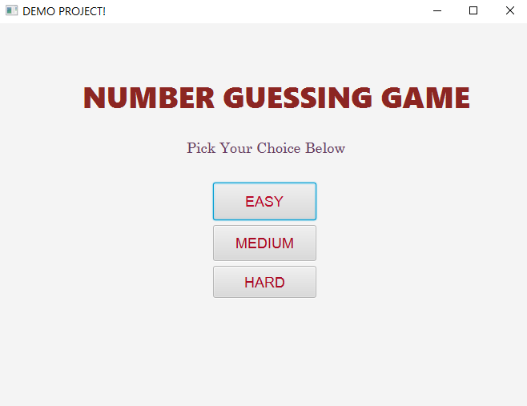
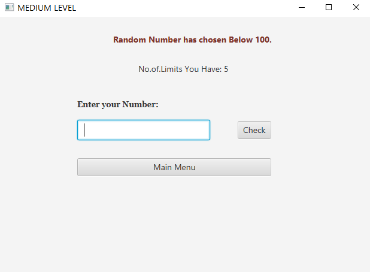

# NUMBER GUESSING GAME 

## Table of contents

- [Overview](#overview)
    - [The challenge](#the-challenge)
    - [Screenshot](#screenshot)
- [My process](#my-process)
    - [Built with](#built-with)
    - [What I learned](#what-i-learned)
    - [Continued development](#continued-development)

### The Challenge

To build the Application of Number Guessing Game using javaFX.

### Screenshot

### Built with

- Java FX
- Java
- Few CSS Properties

### What I learned

Through this Challenge I learned about the [Graphical User Interface](#https://enrico.readthedocs.io/en/latest/gui.html) and How javaFX is more Comfortable for building applications on own.

### Continued development

I build this application only for desktop application. Further I'm interest to develop this as
Responsive size for all platforms. 
